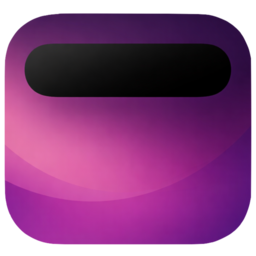
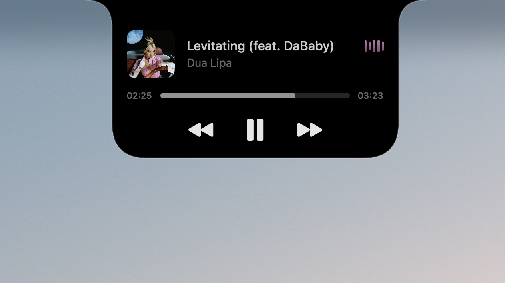

<p align="center">
  
</p>

<h1 align="center">DynamicNotch</h1>

<p align="center">
  <strong>Turn the MacBook notch into a living system surface.</strong>
</p>

<p align="center">
  DynamicNotch is a native macOS utility that brings Dynamic Island-inspired live activities,
  temporary alerts, AirDrop handoff, and custom hardware HUD controls to notched MacBooks.
</p>

<p align="center">
  <a href="https://github.com/jackson-storm/DynamicNotch/releases/latest">
    
  </a>
  
  
  
  <a href="LICENSE">
    
  </a>
</p>

<p>

</p>

## ✨ Why DynamicNotch

DynamicNotch treats the MacBook notch like a compact system surface instead of a static cutout.
It stays close to the hardware shape until something important happens, then expands with native
motion, priority-aware presentation, and focused interactions.

The app is built natively with SwiftUI and AppKit, so the experience feels integrated with macOS
rather than layered on top of it.

## 🚀 Highlights

- 🪟 Native floating notch window aligned to the top display area
- 🎛️ Priority-based live activity and temporary notification orchestration
- 🎵 Persistent live surfaces for Now Playing, Downloads, AirDrop, Focus mode, Personal Hotspot, and Lock Screen
- ⚡ Temporary alerts for charging, battery, Bluetooth, Wi-Fi, VPN, Focus, and resize feedback
- 🎚️ Custom notch HUD for brightness, keyboard backlight, and volume changes
- ⚙️ Native Settings experience grouped into Application, Media & Files, Connectivity, System, and Info sections
- 🧱 Modular notch architecture with `AppContainer`, `NotchEngine`, feature event handlers, and split settings stores
- 📡 AirDrop handoff directly from Finder onto the notch
- 🧪 Integration tests around queue behavior, restore flows, and core feature transitions

## 🎬 Preview

<table>
  <tr>
    <td>
      <video src="https://github.com/user-attachments/assets/88040eb4-a41c-4699-98b7-3242570f4918" controls muted playsinline width="100%"></video>
      <br />
    </td>
    <td>
      <video src="https://github.com/user-attachments/assets/7ec1661d-ff3e-4dc6-9e76-92b00576094f" controls muted playsinline width="100%"></video>
      <br />
    </td>
  </tr>
</table>

>It is demonstrated how the notch appears against various backgrounds. The outline can be removed in the settings, if desired.

## 📦 Installation

1. Download the latest DMG from the [Releases](https://github.com/jackson-storm/DynamicNotch/releases) page.
2. Open the DMG and drag `DynamicNotch` into `Applications`.
3. Launch the app and grant any requested permissions.
4. If macOS blocks the first launch, open `System Settings > Privacy & Security` and choose `Open Anyway`.

> Note
> DynamicNotch is currently unsigned, so the first launch may require manual confirmation in macOS.

## ✅ Requirements

- macOS 14.6 or later
- A MacBook with a hardware notch for the intended experience
- Xcode 15 or later to build from source

## 🛠️ Build From Source

```bash
git clone https://github.com/jackson-storm/DynamicNotch.git
cd DynamicNotch
open DynamicNotch.xcodeproj
```

Then run the `DynamicNotch` scheme from Xcode.

## 🧪 Run Tests

```bash
xcodebuild -project DynamicNotch.xcodeproj -scheme DynamicNotch -destination 'platform=macOS' test
```

Current automated coverage focuses on:

- notch live activity queue behavior
- temporary notification restoration flow
- power transition events
- download monitoring
- network monitoring transitions
- Now Playing session lifecycle

## 🗂️ Repository Layout

```text
DynamicNotch/
├── Application/        # App entry point, dependency container, app delegate, panel setup
├── Core/               # Models, protocols, settings contracts, and low-level services
├── Features/
│   ├── AirDrop/
│   ├── Battery/
│   ├── Bluetooth/
│   ├── Download/
│   ├── Focus/
│   ├── HUD/
│   ├── LockScreen/
│   ├── Network/
│   ├── Notch/          # Notch engine, coordinator, handlers, view model, and UI
│   ├── NowPlaying/
│   ├── Onboarding/
│   └── Settings/
├── Resources/          # App assets and bundled media
└── Shared/             # Shared UI, extensions, and helpers

DynamicNotchTests/
├── Features/
│   ├── Battery/
│   ├── Download/
│   ├── Network/
│   ├── Notch/
│   └── NowPlaying/
└── TestSupport/
```

## 🏗️ Architecture at a Glance

- `AppContainer` composes services, feature view models, coordinators, and window managers in one place
- `AppDelegate` manages app lifecycle, floating notch window setup, window handoff, and platform observers
- `NotchEngine` owns the queue-driven notch state machine for live activities, temporary alerts, transitions, and restore flows
- `NotchViewModel` is the SwiftUI-facing facade for geometry, gestures, interactive sizing, and engine-backed presentation state
- `NotchEventCoordinator` orchestrates routing while feature-specific handlers translate system events into notch content
- `SettingsViewModel` acts as a facade over dedicated settings stores for Application, Media & Files, Connectivity, Battery, HUD, and Lock Screen preferences
- feature view models and services provide domain-specific state streams that feed the notch layer

## 🧰 Tech Stack

- SwiftUI for notch content and settings UI
- AppKit for windowing, input handling, and system integration
- Combine for feature event streams
- [Defaults](https://github.com/sindresorhus/Defaults) for preferences
- [Lottie](https://github.com/airbnb/lottie-ios) for animation assets

## 🙏 Acknowledgements

DynamicNotch benefited from ideas and selected implementation details inspired by other open-source work on GitHub.
Thank you to the maintainers and contributors behind these projects:

- [Ebullioscopic/Atoll](https://github.com/Ebullioscopic/Atoll)
- [MrKai77/DynamicNotchKit](https://github.com/MrKai77/DynamicNotchKit)

## 📈 Project Status

DynamicNotch is actively evolving, but the core notch system is already in place: live activities,
temporary alerts, AirDrop handoff, lock screen transitions, and a dedicated settings experience are
all working today.

Some flows, especially lock-screen-related behavior, rely on private system behavior and may vary
between macOS environments.

## 📄 License

DynamicNotch is released under the GNU General Public License v3.0. See [LICENSE](LICENSE) for details.
