<p align="center">
  
</p>

<h1 align="center">DynamicNotch</h1>

<p align="center">
  <strong>Turn the MacBook notch into a living native surface.</strong>
</p>

<p align="center">
  DynamicNotch is a native macOS app for notched MacBooks that turns the notch into a live system surface for media,
  downloads, AirDrop, timers, screen recording, connectivity events, lock-screen transitions, and custom hardware HUDs.
</p>

<p align="center">
  <a href="https://t.me/Dynamic_Notch">
    
  </a>
  <a href="mailto:evgeniy.petrukovich@icloud.com?subject=A%20question%20about%20Dynamic%20Notch">
    
  </a>
  <a href="https://t.me/id10101101">
    
  </a>
</p>

<p align="center">
  <a href="https://github.com/jackson-storm/DynamicNotch/releases">
    
  </a>
  <a href="https://github.com/jackson-storm/DynamicNotch/releases/latest">
    
  </a>
  <a href="LICENSE">
    
  </a>
  
</p>

<p align="center">
  
  
</p>

## 🧐 Why DynamicNotch

The app is built with SwiftUI and AppKit, so the notch window, settings UI, and event handling feel
like part of macOS rather than a web-style overlay.

The difference between this project and others is that it is built on its own engine, and not taken from other ready-made repositories. It completely copies the logic, animations, and behavior of a real Dynamic Island on an iPhone, unlike other projects. 

The main goal is to make the project as native as possible, both in terms of design and interaction.

## 🎯 Highlights

- **Live Activities**: Now Playing (media control, album artwork, audio visualizer, customizable progress bar tint style), Downloads progress, AirDrop, Timer, Screen Recording indicator, Focus mode, Personal Hotspot, and Lock Screen media/live activity surfaces.

- **Temporary Alerts**: Interactive HUD status for battery charging, low/full battery, Bluetooth connections, Wi-Fi, VPN, Focus-off toggling, and notch size modification settings feedback.

- **Gestures & Swipe Controls**: Native interactive gestures including mouse drag, trackpad swipes, vertical swipe-to-dismiss/restore with adaptive corner radii and swipe-aware blur, and horizontal trackpad/mouse scroll-to-dismiss.

- **Fluid Physics Animations**: True-to-life replication of the iOS Dynamic Island's motion design, featuring responsive physics-based spring animations, jelly-like morphing transitions, and synchronized content interpolation that matches the stretch, squash, and elastic behavior of Apple's implementation.

- **Dynamic Island (Floating Capsule)**: Automatic support for devices without a physical hardware notch (e.g. non-notched MacBooks, iMac, Mac mini, or external monitors). Transitions to a floating capsule shape (`DynamicIslandShape`) when `topInset == 0`, utilizing dynamic, smooth corner radius transitions.

- **Deep Customization**: Personalization options for base notch width/height, stroke options, background styling, animation presets, custom screen/display selection, and fullscreen spaces handling.

## 📦 Installation

1. Download the latest DMG from the [Releases](https://github.com/jackson-storm/DynamicNotch/releases) page.
2. Drag `DynamicNotch` into `Applications`.
3. Launch the app.
4. Grant the permissions needed for the features you want to use.
5. If macOS blocks the first launch, allow it from `System Settings > Privacy & Security`.

## ✅ Requirements

- macOS 14.6 or later
- Works on both notched MacBooks and non-notched displays (automatically rendering as a floating Dynamic Island capsule)
- Feature-specific permissions as needed:
  - Accessibility for custom HUD interception and some system-level interactions
  - Bluetooth access for accessory status updates
  - Screen Recording access for audio-reactive Now Playing visualization where macOS requires it
  - Media/Now Playing access where macOS requires it

## 🛠️ Build From Source

```bash
git clone https://github.com/jackson-storm/DynamicNotch.git
cd DynamicNotch
open DynamicNotch.xcodeproj
```

Then run the `DynamicNotch` scheme from Xcode. Swift Package Manager dependencies are resolved by the project.

## 💻 Gallery

<table align="center">
  <tr>
    <td>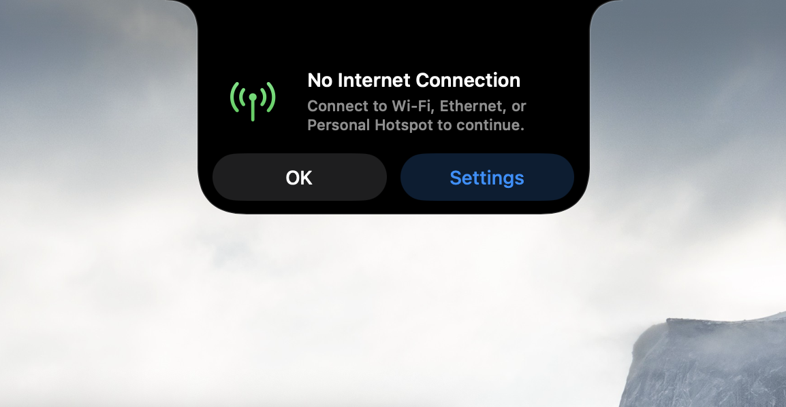</td>
    <td>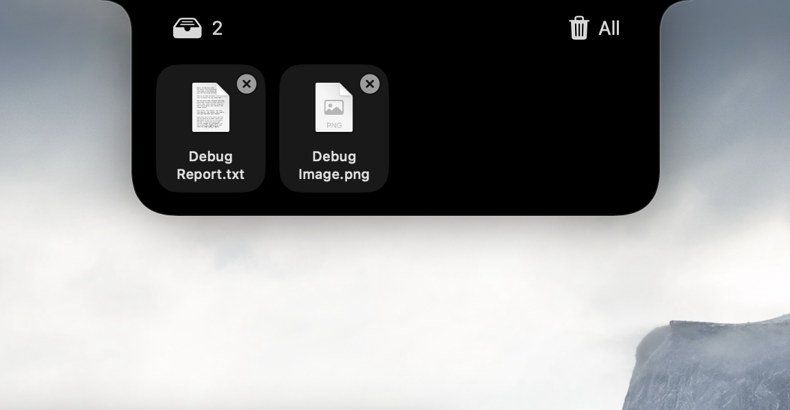</td>
    <td>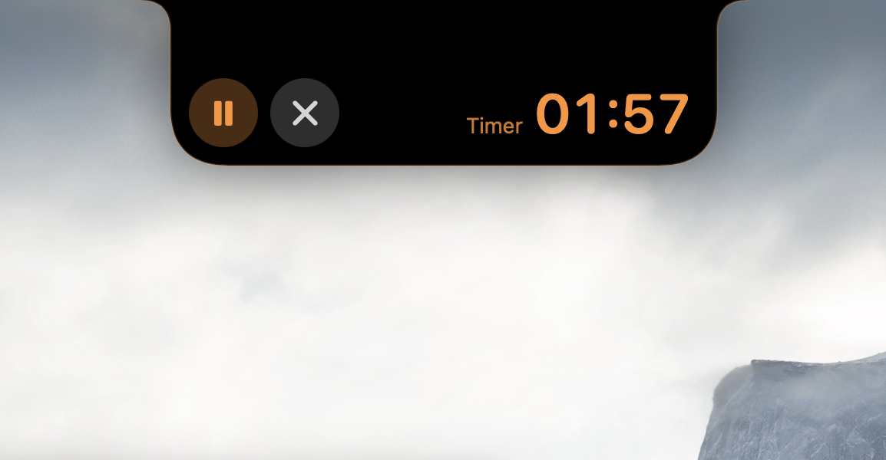</td>
  </tr>
  <tr>
    <td>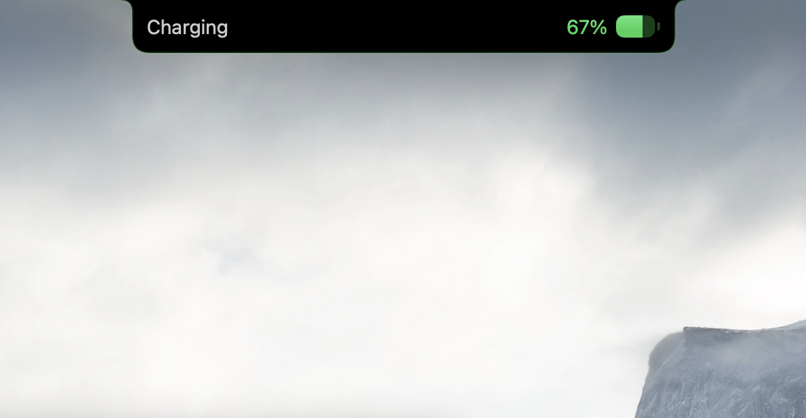</td>
    <td>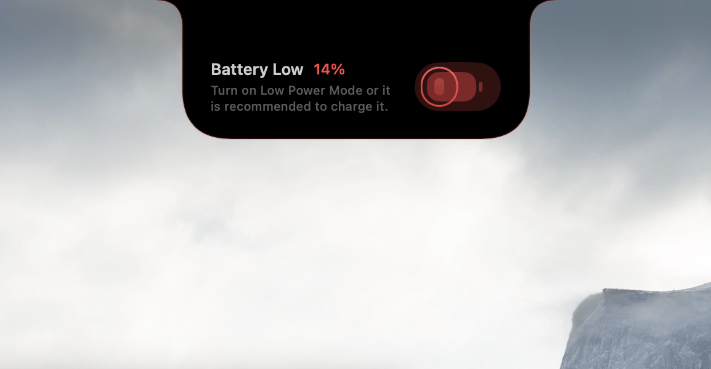</td>
    <td>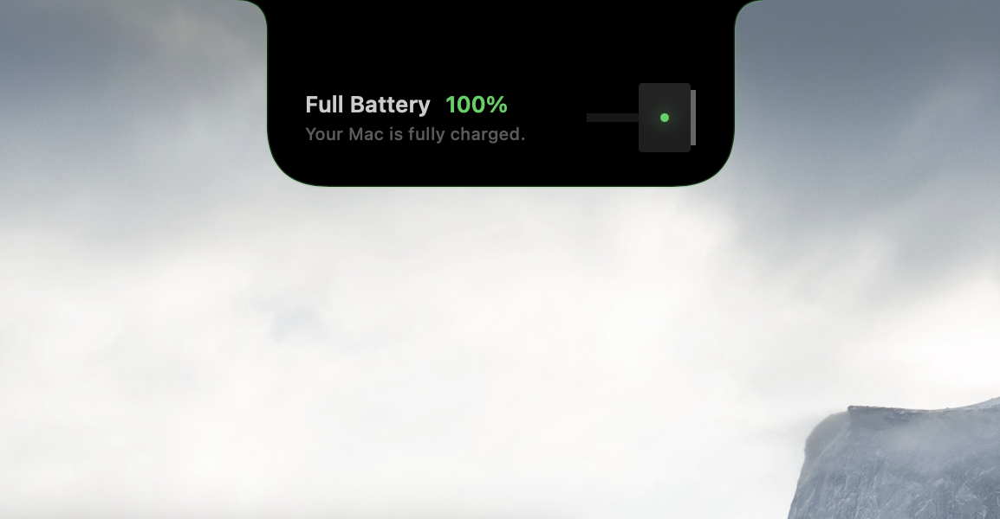</td>
  </tr>
  <tr>
    <td>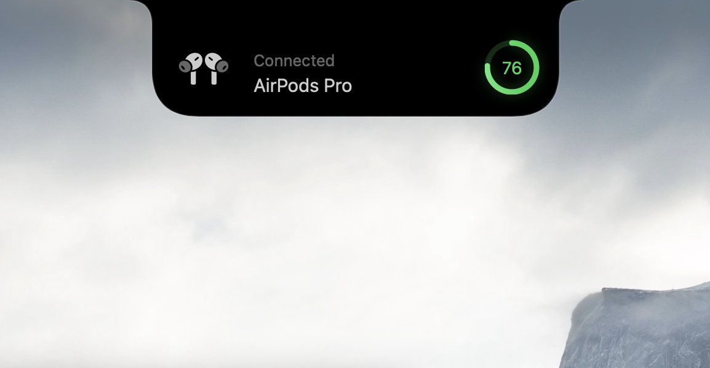</td>
    <td>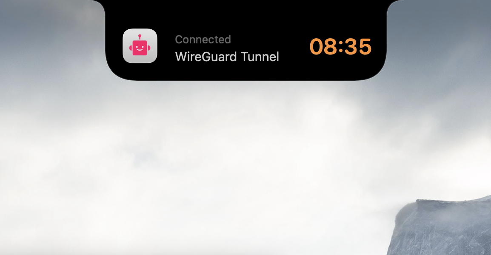</td>
    <td>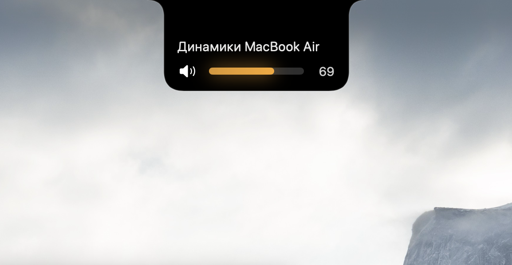</td>
  </tr>
  <tr>
    <td>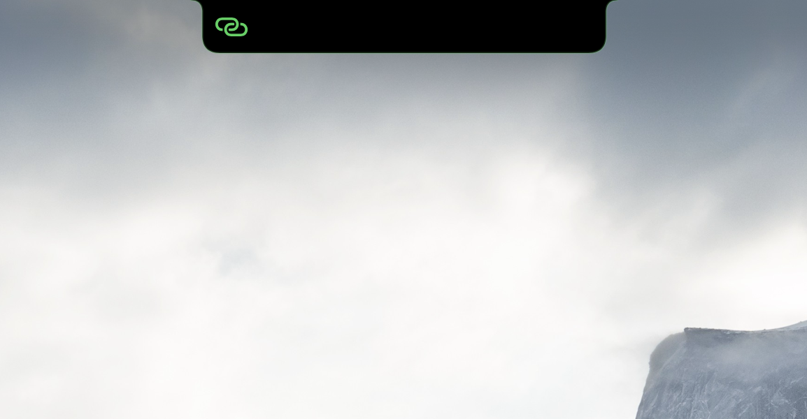</td>
    <td>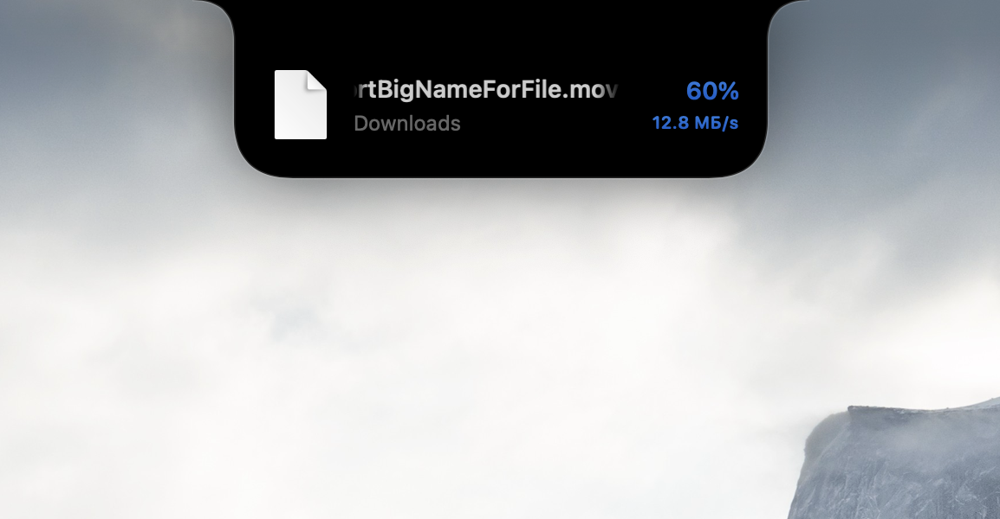</td>
    <td></td>
  </tr>
</table>

> **Note:** This gallery displays only a selection of the events, live activities, and temporary alerts supported by DynamicNotch. Many other states, animations, and system transitions are supported.

## 🧰 Tech Stack

- SwiftUI for notch content and settings UI
- AppKit for windows, input handling, and macOS integration
- Combine for feature and settings streams
- [Lottie](https://github.com/airbnb/lottie-ios) for animation assets

## 🌍 Localization

The project currently includes localized app content for:

- System language fallback
- English
- Russian
- Spanish
- Simplified Chinese

## 🤝 Acknowledgements

Special thanks to the following open-source projects and services that make DynamicNotch possible:

- [Lottie for iOS](https://github.com/airbnb/lottie-ios) — for rendering premium, smooth vector animations.
- [LRCLIB](https://lrclib.net) — for providing the main engine for synchronized lyrics search.
- [Lyrics.ovh](https://lyrics.ovh) — for serving as a fallback database for static song lyrics.
- [mediaremote-adapter](https://github.com/ungive/mediaremote-adapter) — for MediaRemote API integration.

## 📄 License

DynamicNotch is released under the GNU General Public License v3.0. See [LICENSE](LICENSE) for details.
