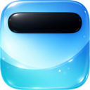

<p align="center">
  
</p>

<h1 align="center">DynamicNotch</h1>

<p align="center">
  Dynamic Island-inspired notch interactions for macOS, built specifically for MacBook displays with a hardware notch.
</p>

<p align="center">
  
  
  
  
</p>

<p align="center">
  <a href="assets/video/charger.mp4">Charger Demo</a>
  ·
  <a href="assets/video/lowBattery.mp4">Low Battery Demo</a>
  ·
  <a href="assets/video/fullCharger.mp4">Full Charge Demo</a>
</p>

<p align="center">
  ⚡ Minimal • 🎯 Native • 🖥️ Notch-first • ✨ Animated
</p>

---

## 🖼️ Preview

| Light Background | Dark Background |
| --- | --- |
|  |  |

## 🌊 Overview

DynamicNotch turns the MacBook notch into a compact UI surface for live activity and short-lived system notifications. It stays visually close to the existing hardware cutout, expands only when needed, and uses a priority-based presentation model to decide what should appear on top.

The project is implemented as a native macOS app with SwiftUI for presentation and AppKit for windowing and input handling.

## ✨ Highlights

- 🪟 Native floating notch window pinned to the top display area
- 🎛️ Priority-driven live activity and temporary notification orchestration
- 🎚️ Custom hardware HUD for brightness, volume, and keyboard backlight changes
- 🎞️ Smooth animated transitions between notch states
- 🔋 Battery, Bluetooth, network, focus, lock screen, now playing, and onboarding-related flows
- 🔒 Optional lock and unlock sounds for lock screen transitions
- ⚙️ Native Settings window with dedicated General, Live Activity, Temporary, and About tabs
- 🧪 Integration tests for the most important service and queue logic

## 🚀 Current Features

### 🔔 Activity Types

- Live activity
  - Now Playing
  - Hotspot active
  - Focus enabled
  - Lock screen live activity
- Temporary activity
  - Charger connected
  - Low power warning
  - Fully charged
  - Wi-Fi connected
  - VPN connected
  - Bluetooth device connected
  - Focus disabled
  - Notch size adjustment feedback
- Other app surfaces
  - Lock screen media panel
  - First-launch onboarding inside the notch
  - Custom notch HUD for brightness, keyboard backlight, and volume

### 🫳 Interactions

- Press interactions on the notch
- Tap to expand supported live content
- Two-finger swipe up to hide active content when the cursor is inside the notch zone

### 🎨 Customization

- Launch at login
- Menu bar icon visibility
- Display selection for main or built-in screen
- Notch stroke visibility and stroke width
- Notch width and height tuning
- Per-feature toggles for live, temporary, and HUD activity types
- Lock screen live activity and media panel toggles

## 🧱 Architecture

The project is organized around application, core, shared UI, and feature layers:

```text
DynamicNotch/
├── Application/        # App entry point, app delegate, notch window setup
├── Core/               # Events, models, protocols, low-level services
├── Features/           # Domain-specific notch content and view models
│   ├── Battery/
│   ├── Bluetooth/
│   ├── Focus/
│   ├── HUD/   
│   ├── LockScreen/
│   ├── Network/
│   ├── Notch/
│   ├── NowPlaying/
│   ├── Onboarding/
│   └── Settings/
│       ├── About/
│       ├── General/
│       ├── LiveActivity/
│       └── TemporaryActivity/
├── Resources/          # App assets and Lottie files
└── Shared/             # Shared UI, private API, extensions

DynamicNotchTests/
├── Features/           # Integration tests by feature
└── TestSupport/        # Test doubles and async helpers
```

Core architectural roles:

- `AppDelegate` creates and manages the floating notch panel
- `NotchViewModel` owns notch state, transitions, and content priority
- `NotchEventCoordinator` translates app/system events into notch content
- Feature view models provide domain-specific event streams and data

## 📥 Install Dynamic Notch

1. Download the latest release DMG from the [Releases](https://github.com/jackson-storm/DynamicNotch/releases) page.
2. Open the DMG and drag `DynamicNotch` into Applications.
3. Launch Dynamic Notch and grant the requested permissions.
4. If macOS blocks the first launch, open `System Settings > Privacy & Security` and choose `Open Anyway`.

## 📋 Requirements

- macOS 14.6 or later
- A MacBook with a hardware notch is recommended for the intended experience
- Xcode 15+ to build from source.

## 🛠️ Build From Source

```bash
git clone https://github.com/jackson-storm/DynamicNotch.git
cd DynamicNotch
open DynamicNotch.xcodeproj
```

Then run the `DynamicNotch` scheme from Xcode.

## ✅ Run Tests

```bash
xcodebuild -project DynamicNotch.xcodeproj -scheme DynamicNotch -destination 'platform=macOS' test
```

Current automated coverage focuses on:

- Notch live activity queue behavior
- Temporary notification restoration flow
- Power transition events
- Network monitoring transitions
- Now Playing session lifecycle
- Lock screen transition behavior

## 📦 Dependencies

- [Defaults](https://github.com/sindresorhus/Defaults)
- [Lottie](https://github.com/airbnb/lottie-ios)

## 💫 Project Status

DynamicNotch already has a solid notch presentation core, gesture support, separate live/temporary settings surfaces, and integration-test coverage for important flows. The project is still evolving, but the main notch behaviors and settings experience are already in place.

## 📄 License

DynamicNotch is released under the GNU General Public License v3.0. See [LICENSE](LICENSE) for details.
